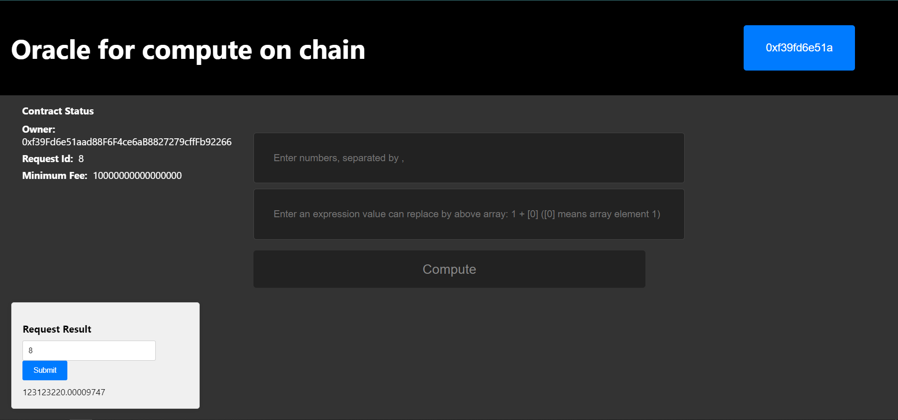
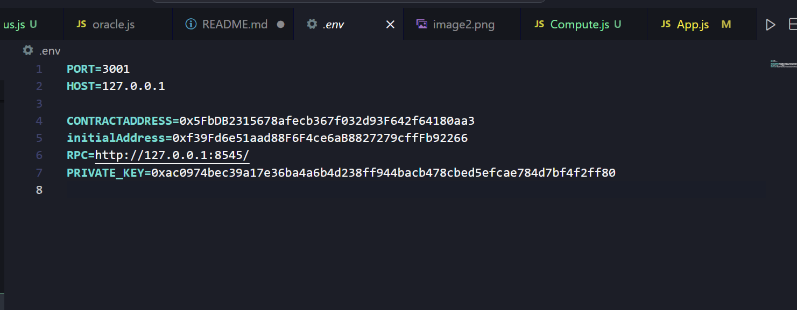
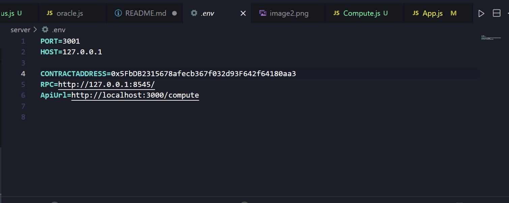
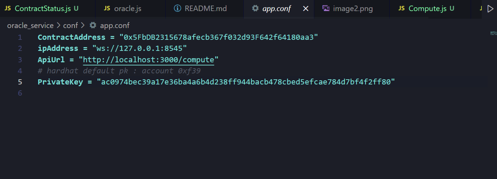

## Eng_interview

## project dir

Eng_interview

├── contracts/  # Solidity contracts

├── gateway/   # gateway               

├── client/    # frontend client 

├── server/    # backend server     

├── api/      # local compute api                  

├── scripts/   # contract deploy      

## start
1. remixd local connect (if need)

```bash
remixd -s ~/Eng_interview/contracts/ -u https://remix.ethereum.org
```

2. hardhat local node 

in root dir
```bash
npx hardhat node
```

3. deploy contract on hardhat

into root dir 
```bash
npx hardhat run scripts/deploy.js
```

4. local api 

into dir sight-interview-compute-api
```bash
npm start
```

5. gateway

into gateway dir 
```bash
go run main.go
```

6. backend

into backend server/ dir 
```bash
node app.js port 3001
```

7. frontend

into frontend client/ dir 
```bash
npm start
```

port : 3000(default) could be impact with api port,set another manully


## compute

type url localhost:3003 into frontend



type nums and expression correctly,and press compute will send a request to contract

leftside record the contract state(remix can also check state )

leftbottom provide a result query interface 


## tip

every time deploy contract will return a address

please check the env file keep them same (sry bout that



.env path:
```
~/Eng_Interview/.env
```

```
~/Eng_Interview/server/.env
```


```
~~/Eng_Interview/oracle_service/app.conf
```


